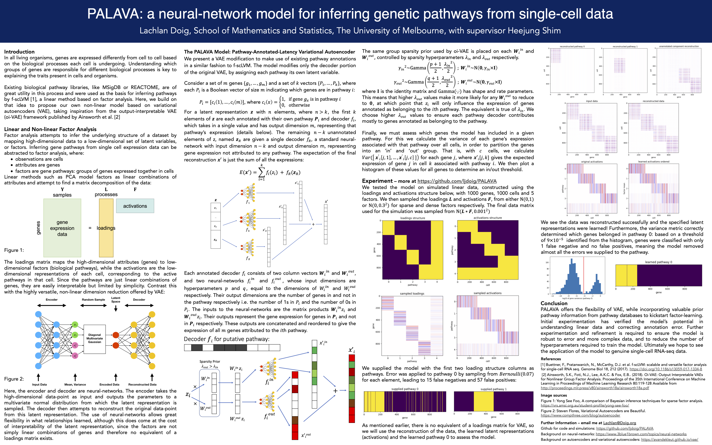

# PALAVA - **P**athway-**A**nnotated-**LA**tency **V**ariational **A**utoencoder
## a pathway-inferring VAE modification for single-cell gene expression data

PALAVA is a dimension reduction model based on VAE that aims to incorporate annotated gene pathways from libraries such as MSigDB or REACTOME. The poster describing this project can be found at https://github.com/ljdoig/PALAVA/blob/main/palava_poster.pdf and is the place to start.

The model aims to unify two previously published models:

- oi-VAE is based on VAE, but partitions the reconstruction into different interpretable groups, and attempts to prune out unhelpful latent variables from each group. This allows an interpretation of the latent representation based on the remaining variables in each group (Samuel K. Ainsworth, Nicholas J. Foti, Adrian K. C. Lee, Emily B. Fox Proceedings of the 35th International Conference on Machine Learning, PMLR 80:119-128, 2018., http://proceedings.mlr.press/v80/ainsworth18a/ainsworth18a.pdf)
- f-scLVM is a linear method based on factor analysis that uses pathway annotations to guide inference of gene expression in single-cell RNA-seq data (Buettner et al. Genome Biology (2017) 18:212 DOI 10.1186/s13059-017-1334-8, https://doi.org/10.1186/s13059-017-1334-8)

We modified the oi-VAE implementation to incorporate the pathway annotation idea from f-scLVM in place of the oi-VAE's 'groups'. The oi-VAE implementation can be found at: https://github.com/samuela/oi-vae

Please start with the poster pdf which will tell you all about the model and explain a little bit about the simulation process. Then take a look at palava_demonstration.ipynb for a more detailed description of the process, and then palava_larger_scale.ipynb for a slightly larger scale simulation. 

The main code for this model can be found in lib/palava.py. If you would like to run simulations with this model yourself, the Jupyter notebooks were run using Python 3.8.5 and Pytorch 1.10.1

For background on neural-networks, I recommend https://www.3blue1brown.com/topics/neural-networks.

For background on autoencoders and variational autoencoders, https://avandekleut.github.io/vae/.
